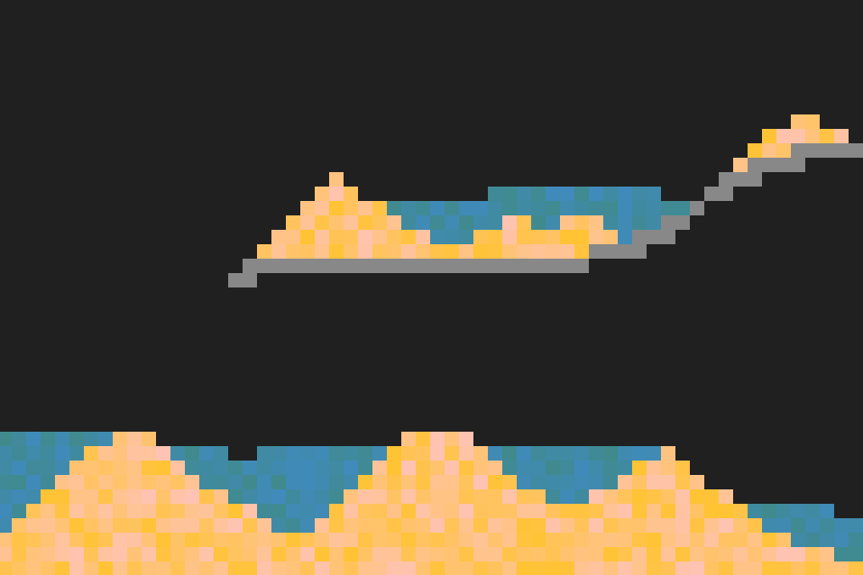

# lfisiks
## a l(little) fisiks(physics) demo built with [minifb](https://github.com/emoon/rust_minifb) in Rust 

lfisiks is a small pixel simulator - or playground - allowing you to mess around with sand, water, stone, and their interactions.

I built this in a couple days to practice and learn Rust. There are many bugs in the current state, but the project demonstrates a bit of minifb's functionality.

Use it however you want; as reference for you project, or as a starting place for an actually good pixel simulation program. Have fun!
